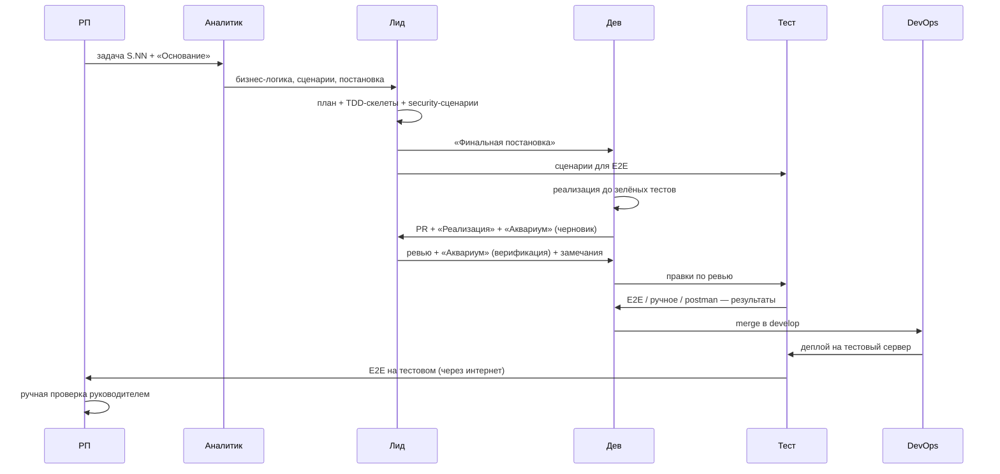

# Воркфлоу команды

Конвейер разработки: от постановки задачи до мержа и деплоя. Все участники (включая РП) работают только через задачи.

## Участники

| Роль | Каталог | Зона ответственности |
|---|---|---|
| Руководитель (человек) | — | финальные решения, ревью и мёрдж PR, ручная проверка |
| РП | `ibs-pm-jan` | пул задач, приоритеты, сроки, канбан, план |
| Аналитик | `ibs-analyst-feb` | бизнес-логика, постановки, сценарии |
| Ведущий разработчик (Лид) | `ibs-lead-apr` | план, TDD-скелеты, security, ревью, «аквариум» |
| Fullstack #1 | `ibs-dev-may` | реализация |
| Fullstack #2 | `ibs-dev-jun` | реализация |
| Тестировщик | `ibs-tester-mar` | E2E (Playwright), ручное тестирование, postman |
| DevOps | `ibs-devops-jul` | gh/PR, деплой, CI, инфраструктура |

## Этапы конвейера

1. **Постановка (РП)** — формирует задачу `S.NN` из ТЗ/требований куратора; заполняет «Основание».
2. **Анализ (Аналитик)** — описывает бизнес-логику, пишет постановку-промт и сценарии (позитив/негатив).
3. **Планирование (Лид)** — критически перерабатывает сценарии, дополняет security, пишет план, скелеты TDD-тестов, формирует «Финальную постановку».
4. **Реализация (Дев) + подготовка E2E (Тестировщик)** — параллельно.
5. **Реализация (Дев)** — код до зелёных тестов, `EXPLAIN` для запросов к БД, рефакторинг.
6. **Ревью (Лид)** — ревью кода + «аквариум» (трассировка по сценариям), замечания.
7. **Доработка + тестирование (Дев → Тестировщик)** — правки по ревью, прогон E2E, ручное тестирование, postman-коллекция.
8. **Merge + деплой (Лид/DevOps)** — PR в `develop`, деплой на тестовый, ручная проверка руководителем.

## Схема

## Артефакты задачи

- Статья задачи (секции по ролям) — шаблон `03-Задачи/_Шаблоны/Задача.md`.
- PR — шаблон `03-Задачи/_Шаблоны/PR.md`.
- Комментарии — живой журнал в статье задачи (формат: `ДД.ММ.ГГ Кто: текст → кому`).
